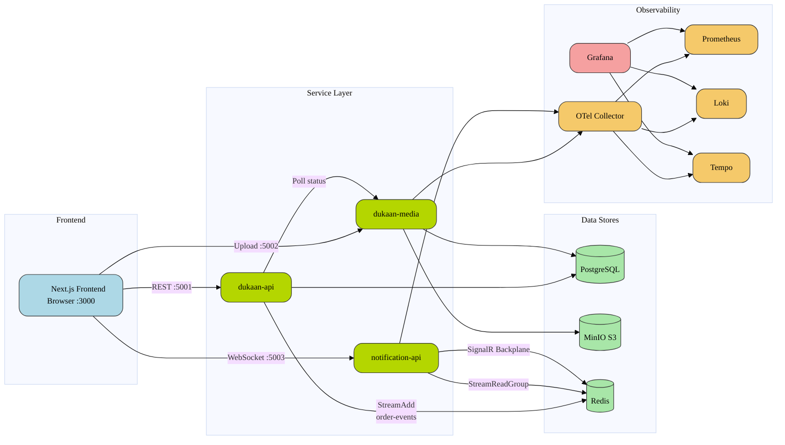

# dukaan-clean-architecture-microservices

> Multi-tenant e-commerce platform built with .NET 8 Clean Architecture and CQRS via MediatR. Event-driven orchestration over Redis Streams with real-time push via SignalR. Next.js 16 frontend with PostgreSQL, Redis, and MinIO on Docker. OpenTelemetry-observed across Grafana, Loki, Tempo, and Prometheus.

`.NET 10` `Next.js 16` `TypeScript 5` `PostgreSQL 17` `Redis 7` `Docker Compose` `Clean Architecture` `CQRS` `SignalR` `OpenTelemetry`

---

## Architecture Overview



---

## Clean Architecture Layers

Each .NET microservice follows onion architecture — dependencies point inward only:

```
    ┌──────────────────────────┐
    │       *.Host             │  ← Controllers, Middleware, Program.cs, DI
    │   ┌──────────────────┐   │
    │   │  *.Infrastructure │   │  ← EF Core DbContext, Repositories, External Services
    │   │  ┌────────────┐   │   │
    │   │  │ *.Application│   │   │  ← CQRS Handlers, DTOs, Validators, Interfaces
    │   │  │  ┌──────┐  │   │   │
    │   │  │  │*.Domain│  │   │   │  ← Entities, Value Objects, Enums (zero deps)
    │   │  │  └──────┘  │   │   │
    │   │  └────────────┘   │   │
    │   └──────────────────┘   │
    └──────────────────────────┘
```

**Rules enforced:**
- Interfaces in Application, implementations in Infrastructure
- No direct DbContext access from Application layer — `IRepository<>` only
- CQRS via MediatR — all business logic in Handlers under `Features/`
- FluentValidation wired via `ValidationBehavior` pipeline

---

## Services

| Service | Port | Purpose |
|---------|------|---------|
| Dukaan API | 5001 | Products, categories, cart, orders, merchants, customers, storefront, auth |
| Dukaan Media | 5002 | Image/file upload, MinIO storage, SkiaSharp processing |
| Notification API | 5003 | SignalR real-time push, Redis Stream consumer, email dispatch |
| PostgreSQL | 5433 | Primary database (multi-tenant shared) |
| Redis | 6379 | Streams (order events), SignalR backplane, caching |
| MinIO | 9000 | Object storage (S3-compatible) |
| MailHog | 8025 / 1025 | Dev email capture |
| Grafana | 3001 | Observability dashboards |
| Loki | 3100 | Log aggregation |
| Tempo | 3200 | Distributed tracing |
| Prometheus | 9091 | Metrics collection |
| Otel Collector | 4317 | OpenTelemetry ingestion endpoint |

---

## Project Structure

```
dukaan-clean-architecture-microservices/
├── backend/
│   ├── docker-compose.yml
│   ├── Dukaan/                          # Main API
│   │   ├── src/
│   │   │   ├── Dukaan.Domain/           # Entities, Value Objects, Interfaces
│   │   │   ├── Dukaan.Application/      # CQRS Handlers, DTOs, Validators
│   │   │   ├── Dukaan.Infrastructure/   # DbContext, Repositories, External Svcs
│   │   │   └── Dukaan.Host/            # Controllers, Middleware, Program.cs
│   │   └── tests/
│   ├── Dukaan.Media/                    # Media upload service
│   │   ├── src/
│   │   │   ├── Dukaan.Media.Domain/
│   │   │   ├── Dukaan.Media.Application/
│   │   │   ├── Dukaan.Media.Infrastructure/
│   │   │   └── Dukaan.Media.Host/
│   │   └── tests/
│   └── Dukaan.Notification/             # Real-time notification service
│       ├── src/
│       │   ├── Dukaan.Notification.Domain/
│       │   ├── Dukaan.Notification.Application/
│       │   ├── Dukaan.Notification.Infrastructure/
│       │   └── Dukaan.Notification.Host/
│       └── tests/
├── frontend/
│   └── dukaan-web/                      # Next.js 16 web app
│       └── src/
│           ├── modules/
│           │   ├── auth/
│           │   ├── cart/
│           │   ├── products/
│           │   └── notifications/
│           ├── lib/
│           └── components/
├── docs/
│   ├── ARCHITECTURE.md
│   ├── PRD.md
│   └── CONVENTIONS.md
├── AGENTS.md
└── README.md
```

---

## Tech Stack

| Category | Technology |
|----------|------------|
| **Backend Runtime** | .NET 10 (target), C# 12, ASP.NET Core |
| **Architecture** | Clean Architecture (Onion), CQRS + MediatR |
| **Validation** | FluentValidation with pipeline behaviors |
| **ORM** | EF Core with PostgreSQL provider |
| **Background Jobs** | Hangfire (scheduled media polling) |
| **Real-time** | SignalR with Redis backplane |
| **Messaging** | Redis Streams (async, at-least-once delivery) |
| **Observability** | OpenTelemetry → Grafana, Loki, Tempo, Prometheus |
| **Testing** | xUnit, Moq, FluentAssertions |
| **Frontend Runtime** | Next.js 16, React 19, TypeScript 5 |
| **State Management** | TanStack Query (server state), React hooks (client state) |
| **Styling** | Tailwind CSS v4, shadcn/ui (Radix primitives) |
| **Frontend Testing** | Jest |
| **Infrastructure** | PostgreSQL 17, Redis 7, MinIO, MailHog, Docker Compose |

---

## Quick Start

### Prerequisites

- **.NET 10 SDK**
- **Node.js 20+**
- **Docker** & Docker Compose

### Terminal 1 — Backend (Infrastructure + APIs + Observability)

```bash
cd backend
docker compose up -d
```

Verify health:

```bash
curl http://localhost:5001/health
```

### Terminal 2 — Frontend (Next.js)

```bash
cd frontend/dukaan-web
npm install
npm run dev
```

### Frontend Environment

Create `frontend/dukaan-web/.env.local`:

```env
NEXT_PUBLIC_API_URL=http://localhost:5001
NEXT_PUBLIC_MEDIA_API_URL=http://localhost:5002
NEXT_PUBLIC_MINIO_URL=http://localhost:9000/dukaan-media
NEXT_PUBLIC_NOTIFICATION_API_URL=http://localhost:5003
```

---

## Service Endpoints

### Frontend

| Resource | URL | Notes |
|----------|-----|-------|
| Web App | [http://localhost:3005](http://localhost:3005) | Main Dukaan storefront |

### Backend APIs

| Service | URL | Notes |
|---------|-----|-------|
| Dukaan API (main) | [http://localhost:5001](http://localhost:5001) | Health: `:5001/health` |
| Dukaan Media | [http://localhost:5002](http://localhost:5002) | Image/file upload |
| Notification API | [http://localhost:5003](http://localhost:5003) | SignalR WebSocket push |

### Infrastructure

| Resource | URL | Notes |
|----------|-----|-------|
| MinIO Console | [http://localhost:9001](http://localhost:9001) | Login: `minioadmin` / `minioadmin` |
| MailHog | [http://localhost:8025](http://localhost:8025) | Captures all outgoing email |
| PostgreSQL | `localhost:5433` | Database (no web UI) |
| Redis | `localhost:6379` | Cache, streams, pub/sub (no web UI) |

### Observability

| Resource | URL | Notes |
|----------|-----|-------|
| Grafana | [http://localhost:3001](http://localhost:3001) | Login: `admin` / `admin` |
| Prometheus | [http://localhost:9091](http://localhost:9091) | Metrics |
| Loki | [http://localhost:3100](http://localhost:3100) | Logs |
| Tempo | [http://localhost:3200](http://localhost:3200) | Traces |

---

## Default Credentials (Dev Only)

| Area | Login | Password |
|------|-------|----------|
| Frontend — Admin | `admin@dukaan.com` | `Admin@123` |
| Frontend — Merchant | `demo@example.com` | `Demo@123` |
| Frontend — Customer | `customer@example.com` | `Customer@123` |
| Grafana | `admin` | `admin` |
| MinIO Console | `minioadmin` | `minioadmin` |
| PostgreSQL | `postgres` | `password` |
| MailHog | *(no login)* | — |

---

## Architecture Decisions

**Multi-tenancy** — Shared PostgreSQL database with tenant isolation via `ITenantEntity` interface, EF Core `HasQueryFilter` for global filtering, and `TenantInterceptor` for automatic `TenantId` assignment. Tenant resolution per request via `TenantMiddleware` setting `ITenantProvider`.

**CQRS + MediatR** — All reads and writes routed through MediatR handlers. Commands mutate state; Queries return DTOs with `AsNoTracking()` for read performance. Validation pipeline ensures invariants before handler execution.

**Inter-service Communication** — Two distinct patterns chosen by use case:
- **Dukaan → Notification**: Redis Streams for async, at-least-once event delivery (order events)
- **Dukaan → Media**: HTTP polling via Hangfire background job (30s interval) for upload status

**Image Processing** — Dedicated `Dukaan.Media` service handles upload → process → store pipeline. SkiaSharp for server-side image manipulation. MinIO provides S3-compatible object storage with bucket-per-tenant isolation.

**Notification Strategy** — Redis Streams decouple event production from consumption. Notification service reads via consumer group, then pushes to frontend via SignalR WebSocket. Redis backplane enables horizontal scaling of SignalR nodes.

**Observability** — OpenTelemetry SDK instruments all .NET services. Traces → Tempo, Logs → Loki, Metrics → Prometheus. Grafana provides unified dashboards. Correlation IDs propagate across service boundaries.

---

## Observability Stack

All services export telemetry via OpenTelemetry → Grafana stack:

```
┌──────────┐    OTLP     ┌──────────────┐    ┌─────────┐
│ .NET APIs │ ──────────▶ │ Otel Collector│───▶ │  Tempo  │ (Traces)
│ Next.js   │   (4317)    │              │    │  Loki   │ (Logs)
└──────────┘              └──────────────┘    │Prometheus│ (Metrics)
                                              └────┬────┘
                                                   │
                                              ┌────▼────┐
                                              │ Grafana │ (Dashboards)
                                              │ :3001   │
                                              └─────────┘
```

Access Grafana at [http://localhost:3001](http://localhost:3001) with pre-configured datasources for all three pillars.

---

## Documentation

| Document | Description |
|----------|-------------|
| [ARCHITECTURE.md](docs/ARCHITECTURE.md) | Full architecture deep-dive, data flow diagrams, ADRs |
| [PRD.md](docs/PRD.md) | Product requirements, feature specs, user stories |
| [CONVENTIONS.md](docs/CONVENTIONS.md) | Coding standards, naming conventions, spec/plan formats |

---

## Stopping

```bash
cd backend && docker compose down
```
